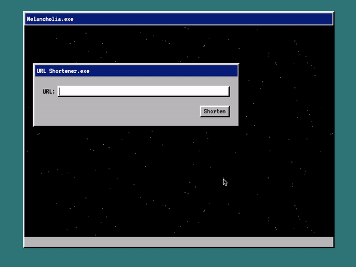

# go-url-shortener
URL shortener made with Go

### How to run it?

1. Clone the repo
1. Download Docker and Docker compose
2. Open the terminal and go to the repo folder
3. Run `docker build --target=production -t davidmoca97/url-shortener`
4. Run `docker-compose up`
5. Open `localhost:9999` in your browser

#### To run a development version with detection of changes in the code
1. Run `docker build --target=development -t davidmoca97/url-shortener-dev`
2. Run `docker-compose -f docker-compose.yml -f docker-compose.dev.yml up`

You can also run the app without Docker with your local instances of Go and MongoDB. Just make sure to have the correspond variables for the database.

To stop the container just `ctr + c` in the terminal